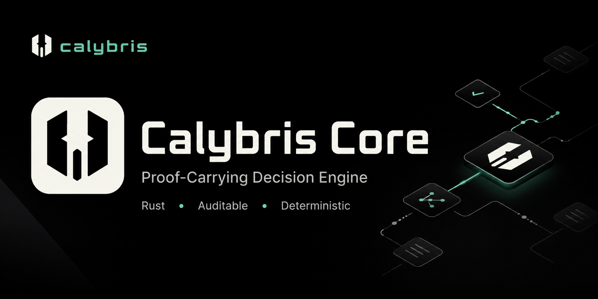

<div align="center">
  
</div>

<br/>

# Calybris Core

[](https://github.com/emirhuseynrmx/calybris-core/actions/workflows/ci.yml)
[](https://crates.io/crates/calybris-core)
[](https://docs.rs/calybris-core)
[](LICENSE)
[]()

Three building blocks for auditable decision systems:

1. **`kernel`** — Integer-only decision kernel. Evaluates candidates against 11 constraints, picks the highest-utility option. No floating-point, no allocation in the hot path. ~115ns per decision.
2. **`wal`** — Hash-chained write-ahead log. Each entry links to the previous via SHA-256 (or HMAC-SHA256 with a key). Generic over any `Serialize` type.
3. **`budget`** — CAS atomic budget engine. Per-tenant reservations with a conservation invariant: `remaining + reserved + committed = initial`.

`#![forbid(unsafe_code)]` · 37 tests · 5 dependencies · Apache-2.0

## Quick Start

```bash
cargo add calybris-core
```

```rust
use calybris_core::kernel::*;

let models = vec![/* your model catalog */];
let snapshot = PolicySnapshot::new(1, 1, 9600, 5500, 3500, 0, models);
let decision = snapshot.prescribe(input);
// decision.action: ExecuteRequested | Substitute | Reject
// decision.selected_model_id: which model was chosen
// decision.expected_utility_microunits: why
```

## Modules

### `kernel.rs`

The kernel scores every candidate model with:

```
utility = quality_adjusted_value - risk_penalty - cost - latency_penalty
```

All values are basis points (1/10,000) or microunits (1/1,000,000). The fast path uses `u64` with overflow guards; when inputs don't fit, it falls back to `u128`. Proptest verifies both paths agree on every random input.

Constraints checked per decision: risk ceiling, confidence floor, quality minimum, budget limit, latency cap, capability match, provider mask, region mask, cost, utility sign, optimality.

### `wal.rs`

```rust
// Unkeyed — detects accidental corruption
let mut wal = WalWriter::open(&path)?;
let entry = wal.append(my_data)?;

// Keyed — attacker can't forge valid hashes
let mut wal = WalWriter::open_keyed(&path, b"secret")?;
```

Chain is validated on open. Constant-time comparison (`subtle`) on keyed WALs. `append()` writes to the OS buffer; call `flush_and_sync()` when you need crash durability.

### `budget.rs`

```rust
let engine = BudgetEngine::new();
engine.ensure_tenant("team-a", 100_000_000);
let (res, id) = engine.try_reserve("team-a", 25_000_000);
engine.commit(id.unwrap(), 20_000_000); // surplus refunded
```

`Arc<AtomicI64>` per tenant, cloned out before the CAS loop — no mutex held during contention. Lock ordering: reservations → budgets.

## Benchmarks

```
cargo bench
```

| Benchmark | Time | Notes |
|-----------|------|-------|
| prescribe (22 models) | 115 ns | ~8.6M/sec |
| prescribe (4 models) | 36 ns | |
| prescribe (64 models) | 522 ns | Linear scaling |
| reject (risk gate) | 15 ns | Early exit |

Results from Criterion on one machine. Your numbers will differ.

## Tests

```
cargo test           # 37 tests (36 + 1 doc)
cargo test --release # includes latency guard
```

Includes proptest property-based verification, 100-thread concurrency stress, HMAC chain validation, and WAL fuzz roundtrips.

## Feature Flags

| Flag | Default | Description |
|------|---------|-------------|
| `std` | yes | Enables `std` types. Disable for `no_std` + `alloc`. |

## What This Crate Is Not

This is the open-source decision core. It doesn't include:

- Adaptive routing (Thompson Sampling)
- Policy evolution (counterfactual replay)
- HTTP gateway or API server
- Prompt classification models

Those are part of the proprietary engine. See [emirhuseyin.tech/engine](https://emirhuseyin.tech/engine) for the full architecture.

## Contributing

See [CONTRIBUTING.md](CONTRIBUTING.md). Issues labeled [`good first issue`](https://github.com/emirhuseynrmx/calybris-core/labels/good%20first%20issue) are a good starting point.

## License

Apache-2.0. See [LICENSE](LICENSE).
